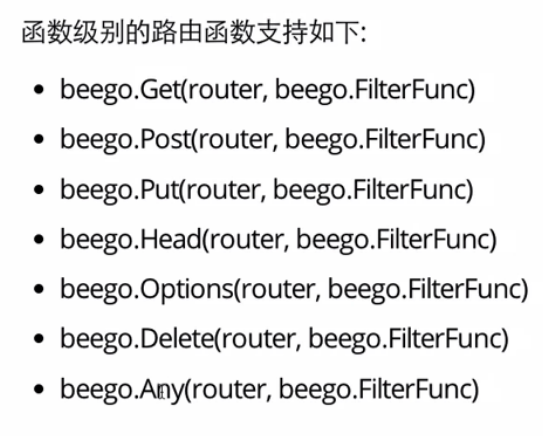

## beego逻辑图


## 什么是路由
在后端，就是根据用户的请求找到需要执行的函数或者controller


## beego路由类型
1. RESTFul
2. controller级别的注册自动化映射
3. 更自由化的handler注册

## 基础路由
1. 函数级别路由

2. controller
```go
type MainController struct {
	beego.Controller
}

func (c *MainController) Get() {
	c.Data["Website"] = "beego.me"
	c.Data["Email"] = "astaxie@gmail.com"
	c.Data["Myname"] = "zhg"
	c.TplName = "index.tpl"
}
beego.Router("/", &controllers.MainController{})
```

## 参数路由


## 映射路由
