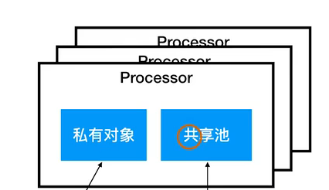

通过go 后面加执行的函数就是协程
```go
func TestGrouptine(t *testing.T){
	for i:=0;i<10;i++{
		go func(i int){
			fmt.Print(i)
		}(i)   //这个地方要用传入的参数i，而不是直接使用循环里的i，因为go里面传参都是值传递，传进来的值被复制了一份，而不会有竞争关系。而直接用i，是对i的地址共享，会有竞争关系，所以会有加锁操作。最后出来的全是10
	}
}
// 每次的执行结果都是随机的
```

## Processor

一个协程有私有对象与共享池，私有对象只能存放一个对象
私有对象是协程安全的，共享池是协程不安全的

