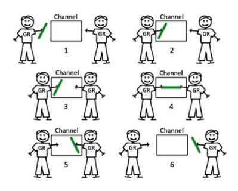
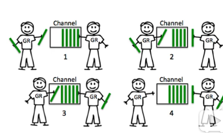

CSP vs.Actor
- Actor Model是直接通讯，CSP则是通过Channel进行通讯
- Go中Channel有容量限制


## channel通讯机制
Go里面有两种channel通讯机制
1. 通讯两方都要在channel中， 如果有一方不在channel中，那另一方就会阻塞等待

2.  Buffer Channel
设定一个channel容量，放消息方可以一直放，直到容量满了，则等待接收方拿消息


```go
func service()string{
	time.Sleep(time.Millisecond *500)
	return "Done"
}
func otherTask(){
	fmt.Println("working on something else")
	time.Sleep(time.Microsecond *1000)
	fmt.Println("Task is done")
}
// channel机制1
func AsyncService() chan string{
	retCh := make(chan string)
	go func() {          // 用另一个协程执行
		ret :=service()
		fmt.Println("return result")
		retCh <- ret      //向通道添加
		fmt.Println("service exited")
	}()
	return retCh
}
func TestAsyncService(t *testing.T){
	retCh :=AsyncService()
	otherTask()
	fmt.Print(<-retCh)     //从通道取出
	//working on something else
	//Task is done
	//return result
	//service exited   说明channel中结果没被使用的时候是阻塞的
}

//channel机制2  buffer channel
func AsyncService() chan string{
	retCh := make(chan string, 1)   //唯一的区别就是在用make声明实例的时候，添加一个buffer容的参数
	go func() {
		ret :=service()
		fmt.Println("return result")
		retCh <- ret
		fmt.Println("service exited")
	}()
	return retCh
}

```

