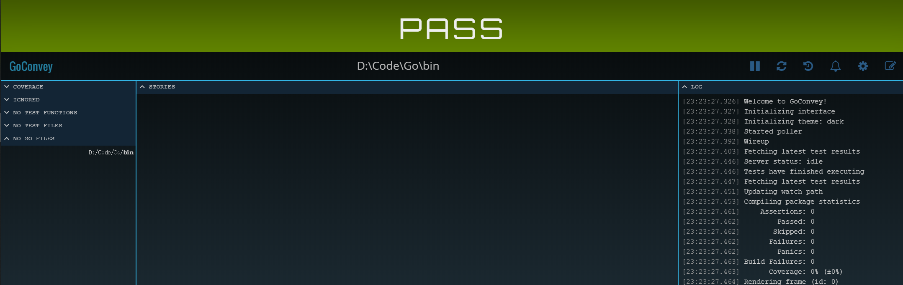

## Goconvey
是一个测试框架,有点像pytest+Allure
```go
func TestConvey(t *testing.T){
	Convey("步骤一:随便写写",t, func() {   //通过convey可以像allure.step一样划分步骤
		var a, b = 1,2
		Convey("步骤二:嗯嗯嗯把他们加起来", func() {
			c:=a+b
			Convey("结果应该是3", func() {
				So(c == 3, ShouldBeTrue) //so是最后结果
			})
		})
	})
}
```


## 可视化
- 在GOPATH/bin中convey,可以生成可视化的网页

