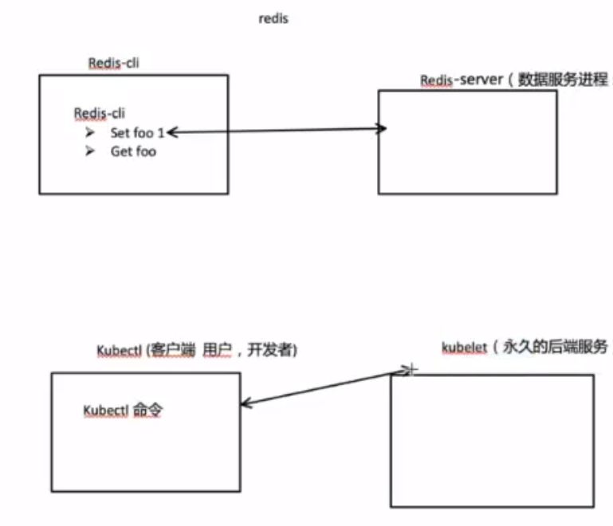

## 防火墙需要打开的端口
| 服务器角色 | 端口      |
| ---------- | --------- |
| etcd       | 2379,2380 |
|Master|6443 , 8472|
|Node|8472|
|LB|8443|

## k8s各个组件
kubelet
kubectl
kubeadm

- 就像 Redis包括Redis-server,作为数据保存,进行实际的操作等,是一只运行的服务进程,而Redis-cli是用户进行指令等操作的部分,用户在Redis-cli进行查询等指令,Redis-cli实际将指令传给Redis-server.
  而kubelet就是哪个后端服务, 而kubectl是那个前端服务

- kubeadm也是一个命令终端,相对于kubectl,kubeadm的权限更高级

