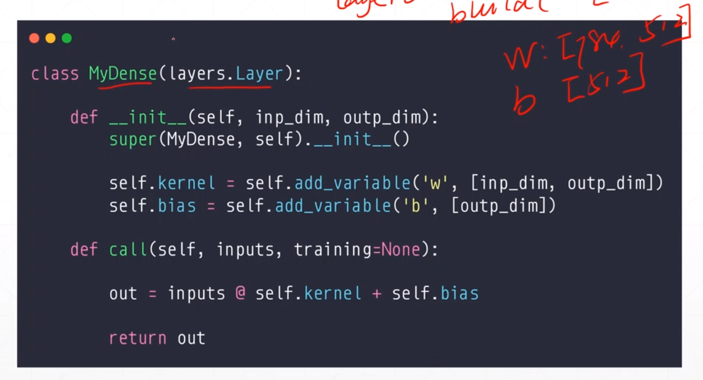
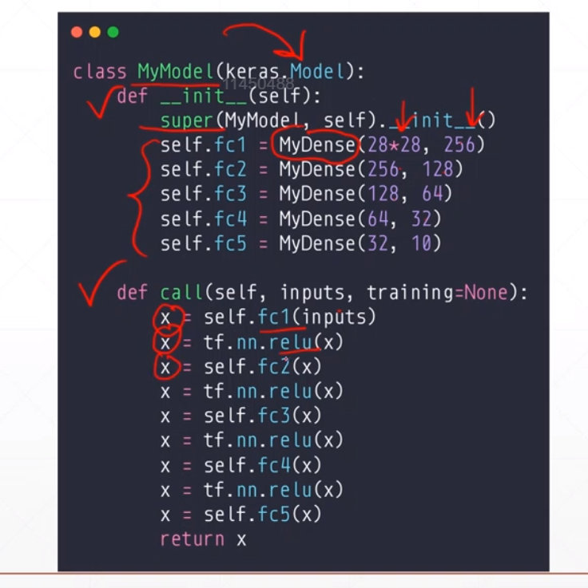

## keras.Sequential
继承于keras.layers.layer的自定义的层,都可以放在Sequential容器中

### Sequential的方法
model.trainable_variables  [w1,b1,w2...]返回所有参数

model.call()

## Layer/Model
自定义层的母类

1. __init__

2. call

3. model:compile/fit/evaluate/predict

## 实现Densen

在内部创建变量要用self.add_variable,因为会有别的功能,而这个函数,在母类中已经实现了

## 实现MyModel
