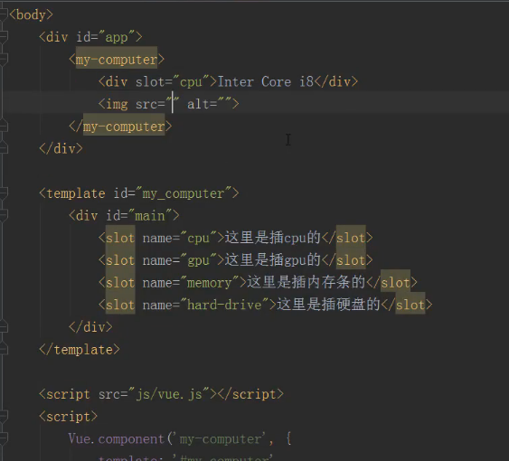

# template
> 通过template标签直接创建模板
```html
	<body>
		
		<div id="app">
			<my-data></my-data>
			<template id="my-data">
				<p>zji</p>
			</template>
		</div>

		<script src="node_modules/vue/dist/vue.js"></script>
		<script>
			Vue.component({
				template:"#my-data"
			})
			let vm = new Vue({
				el:"#app"
			})
		</script>
	</body>
```

## template传值
> 如果模板中要使用某个值，那么绑定的data应当是函数
```html
	<body>
		<template id="my_data">
			<p>{{name}}</p>
		</template>
		
		<div id="app">
			<my-data></my-data>
		</div>

		<script src="node_modules/vue/dist/vue.js"></script>
		<script>
			Vue.component('my-data',{
				template:"#my_data",
				data: function(){
					return{
						name:'zhg'
					}
				}
			})
			let vm = new Vue({
				el:"#app"
			})
		</script>
	</body>
```

## Prop - 父组件把数据传给子组件
```html
	<body>
		<template id="my_data" >
			<div>
				<p>{{name}}</p>
				<p>{{pro}}</p>
			</div>
		</template>
		
		<div id="app">
			<my-data pro="pro通信尝试"></my-data>
		</div>

		<script src="node_modules/vue/dist/vue.js"></script>
		<script>
			Vue.component('my-data',{
				template:"#my_data",
				data: function(){
					return{
						name:'zhg'
					}
				},
				props:['pro']
			})
			let vm = new Vue({
				el:"#app"
			})
		</script>
	</body>
```
**如果是多层组件传递，应该将属性动态绑定**

## 插槽slot


